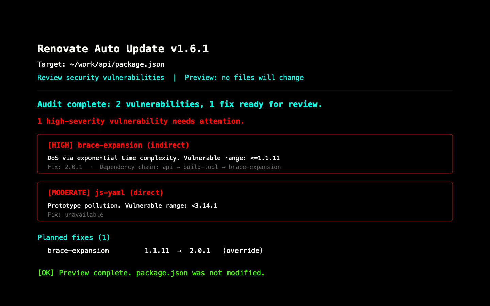

# package-wizard, in plain English

`package-wizard` is a small npm tool for keeping a project's dependencies current.

It can be used as either:

- A command-line tool run from an npm script or with `npx`.
- A TypeScript/JavaScript library imported into another script.

Point it at a project and it reads that project's `package.json`. Depending on the command, it can preview patch, minor, or major updates, review `npm audit` fixes, check for required updates, or preview pinned dependency versions. `--apply` writes reviewed changes. It also understands `renovate.json`, so packages intentionally excluded there stay excluded during normal updates and audit fixes.

When run without arguments in a terminal, it shows the current target
`package.json` path before opening a guided task flow. Users choose a preview,
security audit, maintenance check, or pinning task and see only relevant
settings. Preview results are grouped by dependency section, summarize skipped
packages, and offer an explicit apply confirmation. Human output stays readable
at narrow terminal widths; `--json` keeps one compact result on stdout for
scripts, pipelines, and API integrations.



For the complete command-line option list, modes, output formats, and exit
codes, see the [CLI reference](cli-reference.md). For installation and library
examples, see [using as a project dependency](usage.md).

## Update behavior

The updater reads these dependency sections from the target `package.json`:
`dependencies`, `devDependencies`, `optionalDependencies`, and
`peerDependencies`.

It supports exact versions and simple caret or tilde ranges, such as `1.2.3`,
`^1.2.3`, and `~1.2.3`. Existing `^` and `~` prefixes are preserved unless
the `pin` command is used. With `pin --no-update`, prefixes are removed without
selecting a newer version.

Tags, `workspace:`, `file:`, URL, Git, invalid, and compound range specs are
skipped and reported. Updates are also skipped when no eligible version exists,
when a package is excluded by `--skip`, or when Renovate rules reject the
candidate.

The default update level is `minor`: patch and minor updates are eligible, but
major updates are not. `patch` allows patch updates only; `major` allows any
newer stable version within the configured policies. Prerelease versions are
ignored by default, and updates do not move past npm's `latest` tag by default.

New versions must normally be at least one day old. Configure
`minimumReleaseAge` in `renovate.json` with a duration such as `"3 days"`, a
number of milliseconds, or `false` to disable the filter. Use
`minimumReleaseAgeBehaviour: "timestamp-optional"` when releases without
publication timestamps should remain eligible. The result reports blocked
versions as release-age warnings and installed versions that violate the policy
as release-age errors.

## Audit behavior

Audit mode runs `npm audit --json`. It considers vulnerabilities at `high` or
`critical` severity by default; use `--min-severity` to choose another minimum.
Audit mode previews changes by default. `audit --apply` writes reviewed fixes.
Available fixes can update a
direct dependency or add an `overrides` entry for a transitive dependency.
Disabled or ignored packages are not changed and do not receive overrides.

The `vulnerabilityAlerts.vulnerabilityFixStrategy` setting controls which
available version is selected: `"lowest"` is the default and `"highest"`
selects the highest available fix. `--show-dep-chain` includes the dependency
chain for indirect vulnerabilities.

## Renovate configuration

The tool reads `renovate.json` from the target project. A missing file is valid;
malformed JSON or invalid supported field types fail the operation.

Supported settings include:

- `ignoreDeps` to exclude named packages.
- `allowedVersions` in package rules, using a SemVer range or `/regex/`.
- `ignoreUnstable`, `respectLatest`, and `updatePinnedDependencies` at the root
	or in matching package rules.
- `matchPackageNames`, `matchPackagePatterns`, `matchPackagePrefixes`, and
	`matchDepTypes` to target package rules.
- `matchUpdateTypes` to target patch, minor, or major updates.
- `enabled: false` in a package rule to exclude matching packages completely.

Package rules combine package and dependency-section matchers. A disabled rule
with no matchers applies to every package. Root `enabled: false` is ignored;
package-rule `enabled: false` is the supported exclusion mechanism.

## Technologies it uses

### TypeScript

The source is written in TypeScript. That gives the public library API clear types and catches many mistakes before the package is built.

### Node.js 22+

The package runs on modern Node.js, using Node's file-system, process, and child-process APIs. It uses native ESM modules and publishes both ESM and CommonJS-compatible entry points.

### npm

The tool delegates package metadata and vulnerability work to npm commands. That keeps it aligned with npm's own dependency and audit behavior instead of maintaining a second registry client.

### `semver`

Dependency versions are parsed and compared with `semver`. This is what lets the tool distinguish patch, minor, and major changes while preserving ranges such as `^1.2.3` and `~1.2.3`.

### `@clack/prompts` and `chalk`

These packages handle the interactive experience:

- `@clack/prompts` provides guided prompts and stable progress indicators.
- `chalk` adds restrained color to make results easier to scan.

Package names are shown during longer metadata work, and the same Clack visual vocabulary is used for prompts and progress.

### Jest, ESLint, and tsdown

Jest tests the behavior, ESLint checks code quality, and TypeScript checks types. `tsdown` bundles the final package for publishing without bundling external dependencies unnecessarily.

## A few ways it was made faster

These optimizations mainly reduce repeated work. They do not change what npm reports, and they do not replace npm with direct registry requests.

### Metadata caching

When several parts of a run ask about the same package, the result is reused. One package should not require several identical npm metadata calls.

### Bounded concurrency

Independent package lookups can run at the same time, but only up to a fixed limit. This improves speed without launching an uncontrolled pile of child processes.

### Prefetching

The tool gathers likely package metadata before evaluating every update one by one. That keeps the slower external work moving while the local policy checks remain orderly.

### Dependency-chain caching

Audit and update logic can inspect dependency relationships. Those relationships are cached so the same dependency chain is not walked repeatedly.

### Direct dependency indexing

The package builds quick indexes for direct dependencies and fixed package names. Later checks use those indexes instead of repeatedly scanning every dependency section.

### Precomputed update targets

The tool calculates eligible dependency targets once and reuses them. This avoids repeating the same filtering and section traversal during a run.

### Cached Renovate matchers

Renovate package rules may contain regular expressions. Compiled matchers are cached, which avoids recompiling the same patterns for every package.

### One-time release-age parsing

The `minimumReleaseAge` setting is parsed once and reused while versions are evaluated. Small saving, but useful when a project has many dependencies.

### Atomic `package.json` writes

When changes are written, the file is replaced atomically. An interrupted write is much less likely to leave behind half-written JSON.

## Why the output is structured

Normal output is designed for people. JSON mode is designed for scripts and CI, with successful JSON on stdout and structured errors on stderr. That separation means another tool can consume results without accidentally parsing spinner text or diagnostics. Human result output recommends the install command for the target's configured package manager or lockfile.

The CLI also uses distinct exit codes: `0` for success, `1` for operational errors, and `2` when a mandatory update policy fails.

## Development commands

```bash
npm test          # lint, typecheck, and run Jest
npm run build     # typecheck and create publishable bundles
npm run lint      # run ESLint
npm run check-types
```
