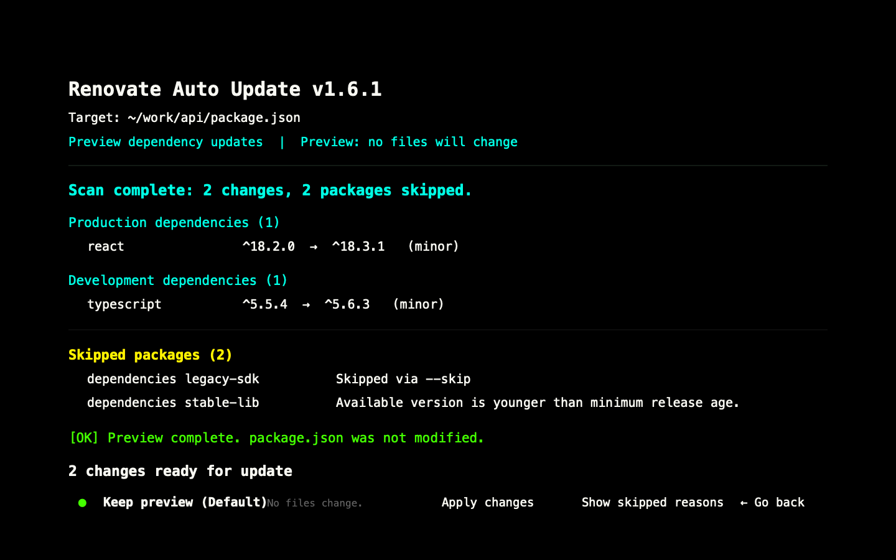

# Using as a project dependency

Install `renovate-auto-update` in the project whose dependencies you want to
manage:

```bash
npm install --save-dev renovate-auto-update
```

You can then add commands to that project's `package.json`:

```json
{
  "scripts": {
    "deps:preview": "renovate-auto-update update",
    "deps:apply": "renovate-auto-update update --apply",
    "deps:check": "renovate-auto-update check",
    "deps:audit": "renovate-auto-update audit"
  }
}
```

Run them from the project directory:

```bash
npm run deps:preview
npm run deps:apply
npm run deps:check
npm run deps:audit
```

For direct CLI usage from scripts or CI, pass options to
`renovate-auto-update`, for example:

```bash
renovate-auto-update update
renovate-auto-update update --apply
renovate-auto-update audit --min-severity high
renovate-auto-update audit --apply
renovate-auto-update check --level major
```

Commands that can change files always preview by default. `--apply` writes `package.json`; use it only after reviewing the preview. `--fix` remains a deprecated compatibility alias for `--apply`.



## Library usage

Import the public helpers into your own TypeScript or JavaScript scripts:

```ts
import {
  checkVulnerabilities,
  hasMandatoryUpdates,
  updatePackageJsonDependencies
} from "renovate-auto-update"

const updates = await updatePackageJsonDependencies({
  cwd: process.cwd(),
  level: "minor",
  dryRun: true
})

const mandatoryCheck = await hasMandatoryUpdates("minor", "high")
const auditReport = await checkVulnerabilities({
  cwd: process.cwd(),
  minSeverity: "high"
})
```

For all available options and exit codes, see the [CLI reference](cli-reference.md).
For update policies, audit behavior, and configuration rules, see the
[package overview](package-overview.md).

## Using with NVM

If you manage Node versions with [nvm](https://github.com/nvm-sh/nvm), install
(or link) the package under the Node version used by the consuming project.
Global installs are scoped to the active Node version.

```bash
nvm use
npm install -g renovate-auto-update
```

For local development with `npm link`, switch to the matching Node version
before building and linking:

```bash
cd renovate-auto-update
nvm use
npm run build
npm link

# In the consuming project
nvm use
npm link renovate-auto-update
```
